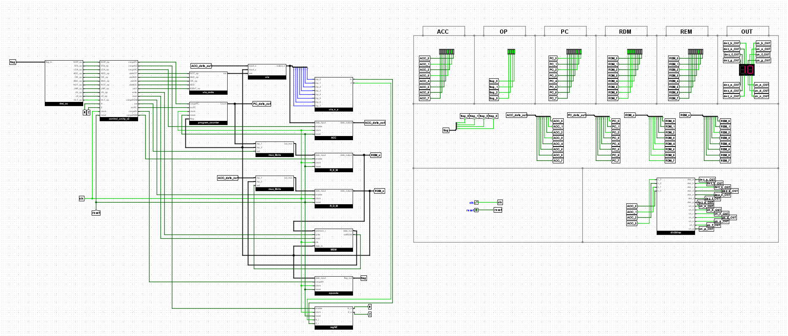
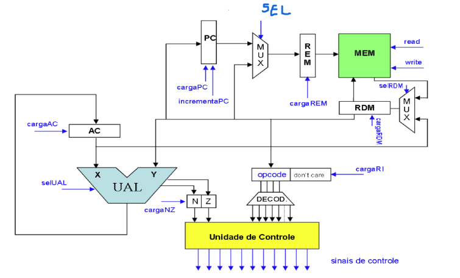

# CPU Neander — Logisim Evolution



## Sobre o projeto

Este projeto implementa, no **Logisim Evolution**, uma CPU didática baseada na arquitetura **Neander**. A organização utiliza **opcode de 4 bits**, caminho de dados e endereços de **8 bits** e uma memória **RAM de 256 × 8 bits**.

A CPU foi dividida em blocos funcionais independentes para facilitar o estudo, a depuração e a evolução da arquitetura. Entre os principais elementos estão o acumulador, Program Counter, REM, RDM, ULA, registrador de flags, memória, decodificação de instruções, geração dos sinais de temporização e unidade de controle.

A unidade de controle utilizada na versão final do projeto é `control_unity_2.0.circ`, desenvolvida como uma versão otimizada da lógica de controle original. O arquivo `control_unity.circ` corresponde a um protótipo anterior, mantido apenas como registro do processo de desenvolvimento e não integra a versão final da CPU.

Também são fornecidos **dois programas de teste** junto ao projeto, permitindo carregar conteúdos previamente preparados na memória e verificar o funcionamento da CPU.

---

## Arquitetura

A implementação segue a organização clássica do Neander. A memória é endereçada pelo **REM (Registrador de Endereços da Memória)**, enquanto o **RDM (Registrador de Dados da Memória)** participa do caminho de dados de leitura e escrita.

O diagrama abaixo apresenta a organização geral da arquitetura implementada:



O gerador de temporização produz os estados `t0` a `t7`, usados pela unidade de controle para coordenar as micro-operações necessárias ao ciclo de busca e à execução das instruções.

### Ciclo de busca

O início da execução de todas as instruções segue a mesma sequência básica:

```text
t0 : REM <- PC

t1 : RDM <- MEM(REM)
     PC  <- PC + 1

t2 : RI <- RDM
```

A partir de `t3`, a sequência passa a depender da instrução decodificada.

---

## Conjunto de instruções

A implementação utiliza o conjunto clássico de instruções do Neander:

| Opcode | Instrução | Operação |
|---|---|---|
| `0000` | `NOP` | Nenhuma operação |
| `0001` | `STA end` | `MEM(end) <- AC` |
| `0010` | `LDA end` | `AC <- MEM(end)` |
| `0011` | `ADD end` | `AC <- AC + MEM(end)` |
| `0100` | `OR end` | `AC <- AC OR MEM(end)` |
| `0101` | `AND end` | `AC <- AC AND MEM(end)` |
| `0110` | `NOT` | `AC <- NOT(AC)` |
| `1000` | `JMP end` | `PC <- end` |
| `1001` | `JN end` | Salta para `end` se `N = 1` |
| `1010` | `JZ end` | Salta para `end` se `Z = 1` |
| `1111` | `HLT` | Interrompe o processamento |

O opcode ocupa os quatro bits mais significativos da palavra de instrução. Nas instruções que utilizam endereço, o byte seguinte contém o endereço do operando.

---

## Arquivos do projeto

### Blocos principais

| Arquivo | Função |
|---|---|
| `top_level.circ` | Circuito de mais alto nível. Integra os registradores, memória, ULA, Program Counter, unidade de controle e demais blocos da CPU. |
| `control_unity.circ` | Protótipo inicial da unidade de controle, mantido apenas como registro do desenvolvimento. Não é utilizado pela versão final da CPU. |
| `control_unity_2.0.circ` | Unidade de controle da versão final da CPU. Gera os sinais responsáveis pelo sequenciamento das micro-operações a partir da instrução, flags e estados temporais. |
| `temp_sinal_gen.circ` | Gera os sinais temporais `t0` a `t7` que sequenciam as micro-operações da CPU. |
| `op_cde.circ` | Bloco associado à decodificação/codificação do opcode das instruções. |
| `DEC.circ` | Bloco de decodificação utilizado pela lógica de controle do processador. |
| `dec_count_c.circ` | Lógica de decodificação associada ao contador usado na geração dos estados temporais. |

### Registradores e caminho de dados

| Arquivo | Função |
|---|---|
| `acumulador.circ` | Implementa o registrador acumulador `AC`, utilizado como operando e destino das operações da ULA. |
| `PC.circ` | Implementa o Program Counter. Permite incremento normal e carga de um novo endereço durante desvios. |
| `rem.circ` | Implementa o REM, Registrador de Endereços da Memória. Sua saída alimenta o barramento de endereço da RAM. |
| `rdm.circ` | Implementa o RDM, Registrador de Dados da Memória. Participa das transferências entre memória, acumulador, ULA e PC. |
| `reg_NZ.circ` | Armazena os flags de condição `N` (negativo) e `Z` (zero). |
| `mux8bits.circ` | Multiplexador de 8 bits utilizado para selecionar fontes de dados dentro do datapath. |

### Unidade Lógica e Aritmética

| Arquivo | Função |
|---|---|
| `ula.circ` | ULA principal da CPU. Reúne as operações aritméticas e lógicas utilizadas pelas instruções. |
| `ula_code_g.circ` | Gera/codifica os sinais de seleção usados para escolher a operação executada pela ULA. |
| `ula_n_z.circ` | Lógica auxiliar relacionada à geração das condições `N` e `Z` a partir do resultado da ULA. |
| `adder8bits.circ` | Somador de 8 bits utilizado pela operação `ADD`. |
| `and_8_bits.circ` | Implementa a operação lógica AND de 8 bits. |
| `or_8_bits.circ` | Implementa a operação lógica OR de 8 bits. |
| `not_8_bits.circ` | Implementa a operação lógica NOT de 8 bits. |
| `ident_8_bits.circ` | Caminho identidade de 8 bits, utilizado quando um valor deve atravessar a ULA sem alteração lógica ou aritmética. |

### Memória

| Arquivo | Função |
|---|---|
| `mem_ram.circ` | Implementa a memória principal da CPU, organizada como **256 posições de 8 bits**. O REM fornece o endereço e o RDM participa do caminho de dados. |

A organização conceitual da memória é:

```text
REM ---------> address

RDM ---------> data_in
MEM.data_out -> RDM
```

Assim, em uma escrita:

```text
MEM(REM) <- RDM
```

E, em uma leitura:

```text
RDM <- MEM(REM)
```

### Visualização

| Arquivo | Função |
|---|---|
| `disp7s.circ` | Decodificação e acionamento de display de sete segmentos. |
| `doubledisp.circ` | Agrupa dois displays para facilitar a visualização de valores de 8 bits em dois dígitos. |

---

## Programas de teste

O diretório contém dois arquivos destinados a testes da CPU:

| Arquivo | Descrição |
|---|---|
| `ex1` | Programa/imagem de memória de teste incluído junto ao projeto. |
| `neander_teste.hex` | Programa de teste em formato hexadecimal, preparado para carregamento na memória. |

Esses arquivos podem ser utilizados para verificar o ciclo completo de busca, decodificação e execução das instruções sem a necessidade de preencher manualmente toda a RAM.

---

## Estrutura do diretório

```text
4bits_neander_cpu/
├── acumulador.circ
├── adder8bits.circ
├── and_8_bits.circ
├── control_unity.circ
├── control_unity_2.0.circ
├── DEC.circ
├── dec_count_c.circ
├── diagram.png
├── disp7s.circ
├── doubledisp.circ
├── ex1
├── ident_8_bits.circ
├── mem_ram.circ
├── mux8bits.circ
├── neander_teste.hex
├── not_8_bits.circ
├── op_cde.circ
├── or_8_bits.circ
├── PC.circ
├── rdm.circ
├── README.md
├── reg_NZ.circ
├── rem.circ
├── temp_sinal_gen.circ
├── top.png
├── top_level.circ
├── ula.circ
├── ula_code_g.circ
└── ula_n_z.circ
```

---

## Como executar

1. Instale e abra o projeto utilizando o **Logisim Evolution**.
2. Mantenha todos os arquivos `.circ` na mesma estrutura de diretório do projeto.
3. Abra `top_level.circ`.
4. Carregue na memória um dos programas de teste fornecidos, quando necessário.
5. Acione o `reset` da CPU para inicializar os registradores e o sequenciador temporal.
6. Libere o `reset` e avance o clock manualmente ou habilite a execução automática.
7. Observe PC, REM, RDM, AC, flags `N/Z`, memória e sinais de controle durante a execução.

Para depuração, o avanço manual do clock é especialmente útil, pois permite acompanhar individualmente os estados `t0` a `t7`.

---

## Organização da memória

A memória principal possui:

```text
256 endereços x 8 bits
```

Portanto:

```text
Endereços : 0x00 até 0xFF
Dados     : 0x00 até 0xFF
```

Um exemplo simples de programa que carrega dois operandos e realiza uma soma seria:

```text
00 : 20    ; LDA
01 : 05    ; endereço do primeiro operando
02 : 30    ; ADD
03 : 06    ; endereço do segundo operando
04 : F0    ; HLT
05 : 03    ; primeiro operando = 3
06 : 02    ; segundo operando = 2
```

Ao final desse exemplo:

```text
AC = 0x05
N  = 0
Z  = 0
```

---

## Observações de implementação

- A arquitetura utiliza **REM para endereçamento da memória** e **RDM para transferência de dados**.
- O `PC` pode ser incrementado durante a execução normal ou carregado pelo caminho de dados durante instruções de desvio.
- As flags `N` e `Z` são atualizadas nas operações que modificam o acumulador.
- O sequenciamento temporal é realizado pelos sinais `t0` a `t7`.
- A versão final do projeto utiliza exclusivamente `control_unity_2.0.circ` como unidade de controle.
- O arquivo `control_unity.circ` é apenas um protótipo anterior preservado como histórico de desenvolvimento.

---

## Objetivo

O objetivo principal deste projeto é permitir o estudo prático da organização de um processador simples, tornando visíveis os principais conceitos de arquitetura de computadores, como:

- ciclo de busca e execução;
- registradores e transferência entre registradores;
- barramentos de dados e endereços;
- unidade lógica e aritmética;
- flags de estado;
- acesso à memória;
- desvios condicionais e incondicionais;
- geração de sinais de controle;
- temporização das micro-operações.

A divisão da CPU em arquivos `.circ` independentes permite analisar e testar cada bloco separadamente antes da integração no circuito de mais alto nível.
